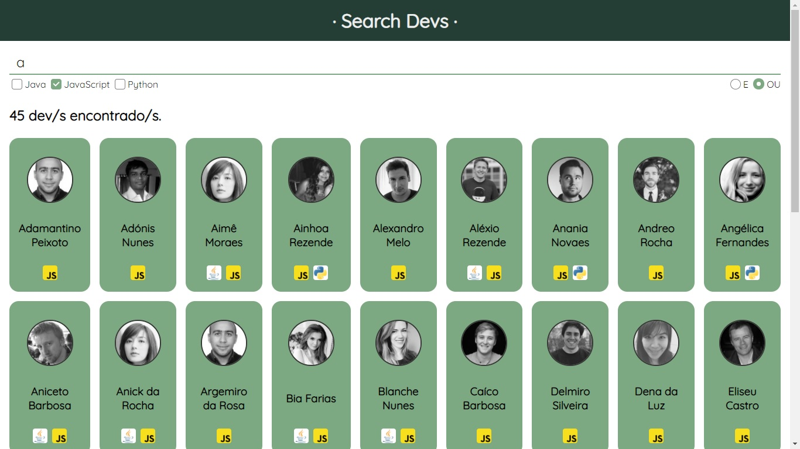

# 🔍 Search Devs (pt-br)
Filtering developers (devs) from a JSON database.

## 💻 Preview

## 📖 About
An application created with HTML, CSS and JavaScript during IGTI's Bootcamp to exercise:
- Declaration of HTML elements such as headings, paragraphs, inputs, divs, spans, etc.
- Style the app with CSS.
- Map DOM elements to be handled with JavaScript.
- Perform various calculations with array methods such as map, filter, some, forEach and includes.
- Perform HTTP requests with the fetch command and use promises or async/await.

## 🛠 Executing the project
**Clone repository** 
`git clone https://github.com/dudaac1/search-devs.git`

**Install dependencies**
>`cd backend` 
`npm install` 
`npm start`

**Opening the application** 
You can run the application by opening the `index.html` file in frontend folder through some browser, such as Google Chrome.
Or you can do this through VSCode: right click on the `index.html` file and `open with live server`.

---
*Developed by Duda Carvalho, September 2020.*
